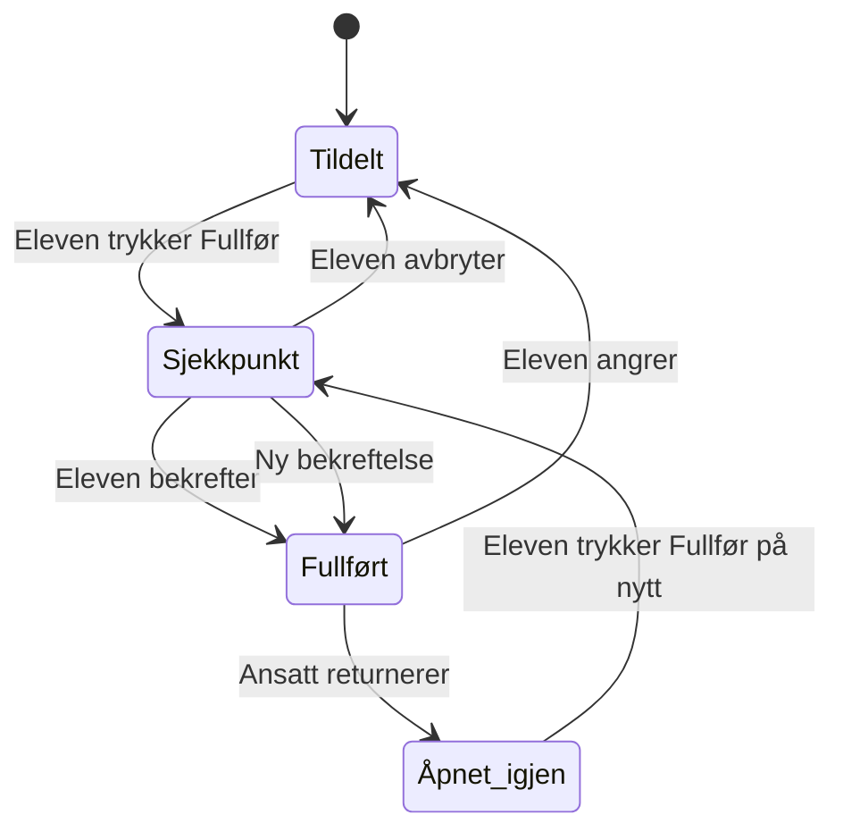

# Klar 3.0 – domenekontrakt for målproduktet

> **Status:** Normativ kontrakt for ønsket produktatferd og UX-retning i Klar
> 3.0. Dokumentet beskriver **målproduktet**, ikke hva den nåværende piloten
> allerede har implementert. Gjeldende pilotfunksjoner og driftsgrenser er
> beskrevet i [`README.md`](../../README.md) og
> [`PILOT_RUNBOOK.md`](../PILOT_RUNBOOK.md).

## 1. Formål og kontraktsnivå

Klar skal hjelpe elever med oversikt, igangsetting, fokus, prioritering og
hjelpesøking i skolehverdagen. Oppgaven utføres som regel utenfor Klar, for
eksempel i en arbeidsbok, på papir, i et klasserom eller i et annet fagverktøy.
Klar er derfor først og fremst et støttende lag rundt skolearbeidet, ikke et
generelt innleverings- eller læringsstyringssystem.

Denne kontrakten skal brukes som felles utgangspunkt for produktdesign,
datamodell, migrasjoner, serverhandlinger, UI, tester og akseptansekriterier.

Nøkkelordene **skal**, **bør** og **kan** betyr:

- **skal:** nødvendig for at implementasjonen er i samsvar med kontrakten;
- **bør:** forventet løsning, men kan fravikes med en dokumentert begrunnelse;
- **kan:** tillatt variasjon som ikke endrer domenets garantier.

En skjerm eller flyt skal ikke omtales som ferdig implementert bare fordi den
er beskrevet her. Hver leveranse må dokumentere hvilke deler av kontrakten den
faktisk oppfyller.

## 2. Autoritative kilder og konfliktregel

Ved motstrid gjelder følgende rekkefølge:

1. eksplisitte produktbeslutninger som er innarbeidet i denne kontrakten;
2. de fem designprinsippene og funnene fra evalueringen i masteroppgaven;
3. produkteierens tidskodede fortellerstemme i videoomvisningen, de utvalgte
   Klar-skjermene og den dokumenterte oppgaveflyten;
4. øvrig UI og kode fra Klar 2.x som designhistorikk;
5. løse idéer, skisser og tidlige konsepter.

For sikkerhet, personvern og autorisasjon er 3.0-arkitekturens grenser et
ufravikelig minimum: serverstyrte mutasjoner, eksplisitt ressursomfang, RLS,
tofaktor for ansatte, dataminimering og revisjonsspor. Historisk 2.x-kode skal
ikke gjeninnføre klientstyrte privilegier eller omgå disse grensene.

Hvis denne målkontrakten og den kjørbare piloten avviker, er
`README.md`, `PILOT_RUNBOOK.md`, migrasjonene og testene sannheten om hva som
kan brukes **nå**. Avviket skal håndteres som planlagt arbeid, ikke skjules i
UI eller dokumentasjon.

Den muntlige produktintensjonen er kuratert og klassifisert i
[`NARRATED_PROTOTYPE_INTENT.md`](./NARRATED_PROTOTYPE_INTENT.md). Talesporet
kan forklare hensikten bak en historisk kontroll, men et åpent alternativ blir
ikke bindende før det er avgjort og innarbeidet i denne kontrakten.

## 3. Førende designprinsipper

### 3.1 Universell tilgang og anti-stigma

- Klar skal kunne brukes av hele klassen, også elever som trenger lite støtte.
- Individuell støtte skal ikke røpe elevens behov for medelever.
- Tilpasninger, stille prioritering i hjelpekø og private ansattopplysninger
  skal være usynlige for andre elever.
- Status skal aldri formidles bare med farge.
- Språk og interaksjoner skal fungere for førsteklassinger og elever med lav
  leseferdighet: få ord, kjente symboler, store målflater og én tydelig handling
  av gangen.

### 3.2 Lav terskel og reell tidsbesparelse for ansatte

- Minste nyttige oppsett skal være å opprette eller velge klasse og elever,
  importere ukeplan, kontrollere resultatet og publisere.
- Avanserte valg skal være tilgjengelige uten å blokkere grunnflyten.
- Massehandlinger og samlet status skal foretrekkes fremfor elev-for-elev-arbeid
  når det ikke går på bekostning av individuell støtte.

### 3.3 Frivillig, ikke-konkurrerende motivasjonsstøtte

- XP, nivåer, blomster, streak og belønninger skal vise egen progresjon og
  mestring, aldri rangere elever mot hverandre.
- Ansatte bestemmer hvilke motivasjonselementer som er tilgjengelige i
  omfanget de har ansvar for.
- Eleven skal kunne redusere eller skjule tilgjengelige elementer uten at
  opptjente data, belønninger eller historikk slettes.

### 3.4 Plattformuavhengighet

- Alle kjerneflyter skal fungere på mobil, iPad/nettbrett og PC.
- En funksjon skal ikke kreve installasjon, en bestemt operativsystemleverandør
  eller hover-interaksjon.
- Responsiv utforming kan endre plassering og tetthet, men skal ikke skjule en
  kjernehandling på små skjermer.

### 3.5 Autonomistøttende stillas

- Klar skal hjelpe eleven med å komme i gang og velge neste handling uten å
  overta arbeidet.
- Mengden informasjon og visuell støtte skal kunne reduseres når eleven ønsker
  eller mestrer mer.
- En tilpasning skal forklare eller demonstrere nok til å skape selvstendighet,
  ikke gjøre eleven avhengig av stadig flere påminnelser.

## 4. Aktører, roller og ressursomfang

### 4.1 Elev

Eleven kan se sin egen dagsflate, sine egne oppgaver, egne valg og egen
progresjon. Eleven kan åpne oppgaver, markere dem som fullført, angre,
eventuelt legge ved eget materiale og be om hjelp. Eleven kan aldri se andre
elevers køplass, oppgavestatus, tilpasninger eller progresjon.

### 4.2 Ansatte

Følgende ansatte skal kunne utføre de samme pedagogiske kjernehandlingene når
de er tildelt riktig ressursomfang:

- kontaktlærer;
- faglærer;
- ITO-/spesialpedagog;
- vikar;
- organisatorisk eier eller administrator med operativt ansvar.

Kjernehandlingene omfatter ukeplan og oppgaver, relevant elevtilpasning,
hjelpekø, gjennomgang av frivillige vedlegg, retur/gjenåpning, belønninger og
private pedagogiske notater der dette senere innføres.

En rolletittel gir ikke global tilgang. Autorisasjon avgjøres av medlemskap og
eksplisitt tildelt organisasjon, klasse, gruppe, fag, elev og tidsrom.

### 4.3 Vikar

En vikar skal kunne gjøre nødvendige pedagogiske handlinger innenfor et
personlig, tidsavgrenset oppdrag. Vikartilgang skal:

- være knyttet til navngitt bruker og tofaktor, ikke en delt lenke eller konto;
- angi start, utløp og hvilke klasser, grupper, elever eller timer den gjelder;
- utløpe automatisk;
- gi samme funksjonelle handlinger som andre ansatte innenfor omfanget;
- inngå i samme autorisasjonskontroll og revisjonsspor.

### 4.4 Organisasjon og omfang

Alle pedagogiske data tilhører én organisasjon. Kryssorganisasjonstilgang er
forbudt. En ansatt kan ha flere samtidige omfang, men hver lesing og mutasjon
skal godkjennes mot den konkrete ressursen. Grupper på tvers av klasser er
tillatt når alle medlemmene og ansvarlige ansatte tilhører samme organisasjon.

## 5. Kjernebegreper

| Begrep | Betydning og garanti |
| --- | --- |
| Organisasjon | Øverste isolasjonsgrense for pedagogiske data. |
| Medlemskap | Kobling mellom bruker, organisasjon og rolle. |
| Ressurstildeling | Hvilke klasser, grupper, fag, elever og tidsrom en ansatt kan handle i. |
| Klasse eller gruppe | Mottakeromfang for planer, undervisningsøkter, oppgaver og hjelpekø. |
| Undervisningsøkt | Et tidsfestet faglig rom i dagsflaten; kan ha oppgaver og én hjelpekø. |
| Ukeplan | Den redigerbare planen for en bestemt uke og mottakergruppe. |
| Planrevisjon | Et uforanderlig publisert øyeblikksbilde av en ukeplan. |
| Importbatch | Én tolking og kontrollert sammenslåing av et kildedokument. |
| Oppgavedefinisjon | Gjenbrukbart innhold: tittel, instruksjon, fag, støtte, XP-verdi og eventuelle medier. |
| Oppgaveiterasjon | En konkret tildeling av en oppgavedefinisjon til mottakere og tidspunkt. Har egen identitet. |
| Fullføringsforsøk | Elevens bekreftede fullføring av én oppgaveiterasjon, med null eller flere frivillige vedlegg. |
| XP-hendelse | Uforanderlig kredit- eller reverseringspost i elevens poenglogg. |
| Nivåmilepæl | Historisk registrering av at eleven har nådd et nivå minst én gang. |
| Belønningstildeling | Unik rett til å velge eller beholde én belønning for en nivåmilepæl. |
| Hjelpekø | En ansattåpnet kø for én klasse/gruppe og normalt én undervisningsøkt. |
| Kødeltakelse | En tidsavgrenset og reviderbar kobling mellom én ansattbruker og én hjelpekø. Deltakelse gir liveoppdateringer og køhandlinger så lenge et aktuelt oppdrag fortsatt autoriserer handlingen. |
| Hjelpeforespørsel | Elevens aktive eller avsluttede køinnslag, valgfritt koblet til en oppgave. |
| Elevpreferanse | Elevens egne valg for informasjonsmengde og synlige motivasjonselementer. |
| Revisjonshendelse | Teknisk spor etter en sikkerhets- eller pedagogisk mutasjon. |

En oppgavedefinisjon og en oppgaveiterasjon skal ikke blandes. En lærer kan
gjenbruke samme definisjon neste dag, men den nye iterasjonen er en ny tildeling
med egen status, XP og historikk.

## 6. Elevens dagsflate

### 6.1 Tidsstyrt struktur

Elevens startside skal organiseres etter dagens undervisningsøkter og vise
forrige, aktuell og neste økt. Aktuell økt er visuelt tydeligst. Oppgaver vises
under økten eller faget de hører til, og eleven skal kunne åpne oppgaven med én
tydelig handling.

«Dagen i dag» skal forbli landingen. En sekundær «Fag og oppgaver»-flate kan
samle alle oppgaveiterasjoner som er synlige for eleven nå, gruppert etter fag.
Den skal bruke de samme assignment-identitetene og overgangene som dagsflaten;
den skal ikke innføre egen rangering, automatisk skjuling/flytting eller en
parallell fullføringsovergang.
Fullførte og gjenåpnede oppgaver forblir synlige i sin faglige sammenheng.

Det skal **ikke** finnes en automatisk «etter skoletid»-modus som:

- rangerer alle uferdige oppgaver på tvers av fag;
- flytter uferdige oppgaver til neste dag;
- fremhever neste skoledag bare fordi siste time er passert; eller
- oppretter ny oppgaveiterasjon uten en ansatts valg.

Den samme dagsstrukturen skal bestå gjennom dagen. Nøyaktig plassering før
første og etter siste økt er et presentasjonsvalg, men skal ikke endre
oppgaveprioritet eller domenestatus.

### 6.2 Oppgaven

Å åpne en oppgave skal vise instruksjonen og relevante støtteressurser. Åpning
er tilstrekkelig for å begynne arbeidet og skal ikke kreve eller vise en egen
«I gang»-knapp.

Åpning kan registreres som begrenset teknisk telemetri hvis det er nødvendig og
lovlig, men skal ikke opprette en pedagogisk status som eleven må administrere.
Den normative oppgavestatusen er ikke avhengig av om oppgavesiden har vært
åpnet.

Inne i oppgaven skal eleven kunne:

- se eller få lest opp instruksjonen;
- bruke eventuell visuell eller trinnvis støtte;
- rekke opp hånden med oppgaven som kontekst, dersom øktens kø er åpen;
- trykke «Fullfør» for å åpne fullføringssjekkpunktet.

### 6.3 Fullføringssjekkpunkt og frivillige vedlegg

Trykk på «Fullfør» skal åpne et rolig og kort sjekkpunkt før status og XP
endres. Sjekkpunktet skal la eleven:

- bekrefte fullføring uten å laste opp noe;
- valgfritt skrive en kort tekst;
- valgfritt spille inn eller velge lyd;
- valgfritt ta eller velge bilde;
- fjerne et valgt vedlegg før bekreftelse; eller
- avbryte og gå tilbake uten status- eller XP-endring.

Tekst, lyd og bilde er alternativer eleven kan velge, ikke krav. Flyten skal
ikke antyde at oppgaven normalt utføres inne i Klar. Den primære
bekreftelseshandlingen skal bruke et gjenkjennelig hakeikon og den korte teksten
«Ferdig». Første trykk på «Fullfør» åpner bare sjekkpunktet; XP skal ikke
tildeles før eleven trykker «Ferdig» i sjekkpunktet.

Ved bekreftelse skal fullføringsforsøket, eventuelle vedleggsreferanser,
oppgavestatus og XP-kreditering behandles som én konsistent operasjon. En
vedleggsfeil skal ikke gi en skjult halvfullført tilstand.

## 7. Oppgavestatus, XP, nivå og belønning

### 7.1 Tilstander og overganger

- `tildelt`: oppgaven kan åpnes og fullføres;
- `fullført`: eleven har bekreftet fullføringen;
- `åpnet_igjen`: en ansatt har returnert oppgaven; funksjonelt fullførbar som
  `tildelt`, men med bevart returhistorikk og en kort, trygg forklaring.

«Åpnet», «lest» eller «i gang» er ikke nødvendige elevstyrte statuser.

### 7.2 XP-regnskap

- Første gyldige bekreftelse av en oppgaveiterasjon skal gi XP umiddelbart.
- Elevens angrehandling skal reversere XP-en som tilhører den aktive
  fullføringen.
- Når en ansatt returnerer eller åpner oppgaven igjen, skal samme XP reverseres.
- Ny fullføring skal kunne kreditere XP på nytt.
- Hver kredit og reversering skal være en uforanderlig loggpost. En reversering
  skal referere til nøyaktig den krediten den opphever.
- Gjentatte klikk, nettverksforsøk, samtidige faner og serverretry skal ikke
  kunne kreditere eller reversere samme overgang flere ganger.
- Statusendring og XP-logg skal være transaksjonelt konsistente.
- XP-verdien for forsøket skal være et snapshot, slik at senere endring av
  oppgavedefinisjonen ikke omskriver historisk poengregnskap.

### 7.3 Nivåmilepæler og vern mot farming

- Nåværende nivå kan følge netto XP og dermed gå ned etter reversering.
- Høyeste oppnådde nivå og registrerte nivåmilepæler skal aldri slettes.
- En elev kan få høyst én belønningstildeling per nivåmilepæl.
- En belønning eleven allerede har valgt, skal beholdes selv om XP reverseres
  og nivået midlertidig går ned.
- En ubrukt eller uvalgt belønning kan settes på vent til eleven igjen har nok
  XP, men det skal ikke opprettes en ny tildeling for samme nivå.
- Når samme nivå nås igjen, skal eleven ikke få ny belønning eller en ny
  førstegangs-milepæl. UI kan markere at nivået er gjenvunnet uten å gjenta en
  stor belønningsfeiring.
- En ny, bevisst oppgaveiterasjon opprettet av en ansatt er selvstendig og kan
  gi XP. Å fullføre samme iterasjon gjentatte ganger kan ikke brukes til farming.

### 7.4 Retur og angre

Eleven skal kunne angre et feiltrykk uten straffende språk. En ansatt kan åpne
oppgaven igjen når eleven skal arbeide videre. UI-et bør bruke «åpnet igjen»
fremfor «underkjent».

Retur fra ansatt skal ha en kort pedagogisk forklaring eller strukturert årsak
som eleven kan forstå, men fritekst skal dataminimeres. Angre og retur skal
bevare historikken; de skal ikke hard-slette fullføringsforsøket eller
XP-hendelsene.

## 8. Hjelpekø

### 8.1 Når køen finnes

En autorisert ansatt åpner hjelpekø for en bestemt klasse eller gruppe og en
bestemt undervisningsøkt. Først da skal håndsymbolet vises i elevens footer og
inne i relevante oppgaver. Når køen ikke er åpen, skal handlingen ikke fremstå
som tilgjengelig.

En kø skal ha eieromfang, åpningstid, status og revisjonshistorikk. En aktiv
forespørsel skal ikke forsvinne lydløst dersom køen stenges. Køen skal først
slutte å ta imot nye elever; aktive forespørsler skal avsluttes, håndteres eller
kanselleres eksplisitt.

Den som åpner køen blir første aktive deltaker. Andre autoriserte ansatte kan
melde seg inn eksplisitt. Deltakelsen tilhører ansattbrukeren, mens hvert kall
fortsatt må autoriseres med et aktuelt oppdrag for den konkrete klassen. Bytte
mellom overlappende oppdrag for samme bruker skal derfor ikke skape en ny
deltaker eller gjøre en gyldig deltaker handlingslammet.

«Forlat køen» er en personlig handling og skal ikke stenge køen for de andre.
Den er bare tillatt når minst én annen aktiv deltaker blir igjen og den som går
ut ikke eier en aktiv forespørsel. Eide forespørsler må først løses, frigis eller
overføres. «Steng kø» er en egen, global handling som enhver aktiv deltaker kan
velge; den stopper nye elevforespørsler, men lar gjenværende deltakere tømme
køen før den blir lukket.

Utløpt eller tilbakekalt oppdrag skal fjerne brukerens deltakelse automatisk og
returnere eventuelt eid arbeid til køen. Hvis ingen gyldige deltakere gjenstår,
går køen til `stenger` uten å miste aktive forespørsler. En ny autorisert ansatt
kan da overta den foreldreløse køen og tømme den.

### 8.2 Elevinteraksjon

Elevens køflate skal være ikonførst og tekstfattig:

1. En kjent hånd/«rekk opp hånden»-ikon vises i footeren når køen er åpen.
2. Ett trykk oppretter forespørselen og kontrollen endres til «Står i kø».
3. Nytt trykk gir en kompakt og tydelig mulighet til å krysse forespørselen
   bort. Et utilsiktet trykk skal kunne avbrytes.
4. Når forespørselen er avsluttet, går kontrollen tilbake til hånden dersom
   køen fortsatt er åpen.

Det skal ikke kreves en forklarende tekst, et skjema eller valg av køgrunn.
Ikoner skal være vanlige, gjenkjennelige mønstre fra apper, nettsteder og
PWA-er. Den synlige teksten skal være kort, men kontrollen skal fortsatt ha
tilgjengelig navn og tilstand for skjermleser.

Eleven skal ikke se nøyaktig køplass eller at en ansatt har prioritert om
rekkefølgen. `Står i kø` dekker både ventende og eventuelt overtatt forespørsel
for å holde modellen enkel.

### 8.3 Valgfri oppgavekontekst

- Forespørsel fra footeren opprettes uten oppgavekobling.
- Forespørsel fra en åpen oppgave kan kobles til den oppgaveiterasjonen.
- Oppgavekoblingen er valgfri og skal aldri hindre eleven i å be om hjelp.
- En elev skal bare ha én aktiv forespørsel i samme kø.
- Dersom eleven knytter en eksisterende generell forespørsel til en oppgave,
  skal køtid og intern rekkefølge ikke nullstilles.

### 8.4 Ansattflaten

Autoriserte ansatte skal kunne se nøyaktig rekkefølge, ventetid, elev,
eventuell oppgavekontekst og køstatus. De skal kunne:

- åpne og stenge køen;
- melde seg inn i en delt kø og se hvor mange ansatte som deltar;
- forlate egne liveoppdateringer uten å stenge køen for de andre;
- overta, løse og avslutte en forespørsel;
- frigi eller overføre en forespørsel til en annen aktiv deltaker;
- prioritere eller flytte en forespørsel uten at dette eksponeres for eleven;
- se hvem som sist endret prioritet og når.

En autorisert ansatt som ikke deltar, kan orientere seg i køstatusen, men skal
ikke kunne mutere køen eller abonnere på den løpende ansattstrømmen før
vedkommende velger «Bli med». Dette gjør at en lærer som går til en annen klasse
kan velge «Forlat køen» og slippe varsler, mens de gjenværende lærerne fortsetter
uavbrutt. Personlig uttreden skal også være mulig mens køen tømmes i `closing`,
så lenge en annen deltaker står igjen og den som går ikke eier en aktiv
forespørsel. Global «Steng kø» og personlig «Forlat køen» skal aldri være samme
handling.

Stille prioritering er en pedagogisk tilpasning, ikke en elevrangering. Hver
manuell endring av rekkefølgen skal logges med aktør, tidspunkt, kø,
forespørsel og før/etter-posisjon. En eventuell begrunnelse skal være privat for
ansatte og bør være strukturert fremfor fri elevtekst.

## 9. Smart Import og ukeplanrevisjoner

### 9.1 Omfang

Smart Import skal kunne tolke hele ukeplanen, ikke bare en oppgaveliste:

- undervisningsøkter og tidsplan;
- fag og mottakere;
- beskjeder;
- læringsmål;
- oppgaver med instruksjon, tidspunkt og eventuell støtte.

Tolking skal alltid produsere en redigerbar forhåndsvisning. Ingenting skal
publiseres uten eksplisitt godkjenning fra en autorisert ansatt. Målkontrakten
bestemmer ikke om tolkingen er regelbasert eller bruker en senere godkjent
tjeneste; piloten følger fortsatt runbookens grense om lokal, regelbasert
DOCX-tolking.

### 9.2 Idempotens og kildespor

Hver import skal lagre dokumenthash, importbatch, tidspunkt, aktør og et
spor fra tolket element tilbake til kilden. Ny opplasting av identisk innhold
skal gjenkjennes og skal ikke opprette duplikater.

Elementmatching skal prioritere stabile kildeidentifikatorer. Når slike ikke
finnes, kan normalisert innhold, plassering og fag/tid brukes som forslag, men
usikker matching skal gjennomgås av en ansatt.

### 9.3 Treveis sammenslåing ved ny import

En ny import skal sammenligne:

- **B – base:** siste importerte og publiserte kildeversjon;
- **K – Klar:** gjeldende plan etter manuelle endringer i Klar;
- **N – ny:** den nye tolkingen av kildedokumentet.

| Situasjon | Standardhandling |
| --- | --- |
| `N = B`, mens `K` er endret | Behold den manuelle Klar-endringen. |
| `K = B`, mens `N` er endret | Foreslå oppdateringen fra ny kilde. |
| `K = N` | Ingen konflikt eller duplisering. |
| Både `K` og `N` er endret forskjellig | Vis konflikt side ved side; behold `K` som forhåndsvalgt verdi. |
| Nytt element finnes bare i `N` | Foreslå opprettelse. |
| Nytt element finnes bare i `K` | Behold det lokale elementet. |
| Element er fjernet fra `N`, men uendret i `K` | Foreslå arkivering; krev eksplisitt godkjenning. |
| Element er fjernet fra én side og endret på den andre | Behandle som konflikt. |

Før publisering skal den ansatte kunne se en samlet oversikt over nye,
endrede, beholdte, arkiverte og konfliktfylte elementer. Alle konflikter må
avgjøres. Publisering skal opprette én ny, uforanderlig planrevisjon og skje
transaksjonelt.

### 9.4 Historikk og allerede tildelte oppgaver

- Publiserte planrevisjoner skal ikke overskrives; ny publisering lager ny
  revisjon med lenke til forrige.
- Fullføringsforsøk, vedlegg, XP og køhistorikk skal alltid peke på den
  oppgaveversjonen eleven faktisk så.
- Et element med elevhistorikk skal ikke hard-slettes eller få historisk
  innhold omskrevet av en reimport.
- Vesentlig endring av en allerede delt oppgave skal opprette en ny versjon
  eller iterasjon for framtidig bruk, med tydelig forhåndsvisning av berørte
  mottakere.
- Import av en ukeplan skal ikke endre skolens permanente grunntimeplan uten
  en separat og eksplisitt handling.
- Systemet skal kunne rulle tilbake hvilken planrevisjon som er aktiv, uten å
  slette senere historikk.

### 9.5 Frivillig flytting eller ny iterasjon

Lærerdashboardet kan tilby to tydelig forskjellige, valgfrie handlinger for en
oppgave som skal dukke opp en valgt senere dag eller undervisningsøkt:

1. **Flytt samme uferdige oppgave.** Den eksisterende oppgaveiterasjonen
   beholder identitet, status, historikk og samme ene XP-mulighet. Bare det
   planlagte tidspunktet endres. Opprinnelig tidspunkt og endringen bevares i
   revisjonssporet.
2. **Send ut på nytt.** Det opprettes en ny oppgaveiterasjon med egen identitet,
   elevstatus og XP-mulighet. Den opprinnelige iterasjonen og historikken
   endres ikke, og begge peker på den gjenbrukte oppgavedefinisjonen.

Begge handlingene skal:

- være initiert og bekreftet av en autorisert ansatt;
- la den ansatte velge senere dag eller undervisningsøkt;
- vise handlingstype, mottakere, tidspunkt og innhold før publisering;
- gjøre forskjellen mellom «flytt» og «send ut på nytt» forståelig før
  bekreftelse;
- aldri utløses automatisk av klokkeslett, skoledagens slutt eller ufullført
  status.

En oppgave med fullførings- eller returhistorikk skal ikke miste denne
historikken ved flytting. Hvis handlingen gjelder bare enkelte mottakere, skal
mottakeromfanget velges eksplisitt og ikke utledes skjult av systemet.

## 10. Motivasjonsstøtte og elevvalg

Ansatte setter et tilgjengelighetsnivå for motivasjonselementer per relevant
klasse, gruppe eller elev. Eleven kan deretter velge en roligere presentasjon
innenfor disse rammene. En anbefalt kapabilitetsmodell er:

- rolig progresjon uten synlige poeng;
- XP og nivå;
- blomsterhage eller annen personlig samling;
- streak der fravær kan pause, men ikke straffe;
- individuelle belønninger eller kuponger;
- senere felles klasseelementer uten individuell rangering.

Å skjule eller skru ned et element er et visningsvalg, ikke sletting. XP-logg,
nivåmilepæler, opptjente blomster og valgte belønninger skal bestå. Det skal
ikke finnes toppliste, offentlig poengsammenligning eller konkurranse som gjør
støttebehov synlig.

## 11. Responsivitet og tilgjengelighet

Klar skal utformes og testes mot WCAG 2.2 AA som minimumsmål, inkludert:

- tastaturbetjening og synlig fokus;
- korrekt semantikk, navn, rolle og tilstand for skjermleser;
- 200 prosent zoom og responsiv reflow;
- redusert bevegelse uten tap av mening eller funksjon;
- tekstalternativ for meningsbærende grafikk;
- status som ikke er fargeavhengig;
- store og adskilte berøringsmål, med 44 × 44 CSS-piksler som anbefalt
  minimum for elevens primærhandlinger;
- ingen hover-avhengige handlinger;
- støtte for både stående og liggende nettbrett;
- norsk bokmål og konsekvent, alderspasset ordbruk.

Ikonførst betyr ikke ikon uten tilgjengelig navn. Et kjent håndsymbol kan være
nok synlig forklaring for eleven, mens `aria-label`, tilstandsbeskrivelse og
eventuelt skjermlesertekst gir samme informasjon ikke-visuelt.

Elevflaten skal prioritere store målflater, lav informasjonstetthet og én klar
primærhandling. Ansattflaten kan være tettere, men skal ha samme semantiske og
motoriske tilgjengelighet. Dialoger og sidepaneler skal håndtere fokus,
Escape/lukking og fokusretur korrekt.

## 12. Personvern, medier og revisjon

### 12.1 Dataminimering

- Klar skal ikke kreve innlevering for å registrere fullføring.
- Tekst, lyd og bilde skal være uttrykkelig frivillig og bare knyttes til den
  konkrete oppgaveiterasjonen og fullføringsforsøket.
- UI skal forklare mottaker og formål i en alderspasset form før opptak eller
  opplasting.
- Tilgang skal avgrenses til eleven og ansatte med relevant ressursomfang.
- Medier skal ha definert lagringssted, filkontroll, tilgangskontroll,
  oppbevaring og sletting før funksjonen aktiveres i skolepilot.
- Sensoriske elevdata og vedleggsinnhold skal ikke kopieres til generell
  telemetri eller revisjonslogg.

### 12.2 Revisjonsspor

Følgende mutasjoner skal minst kunne etterprøves med organisasjon, aktør,
ressurs, hendelsestype og tidspunkt:

- publisering, reimport, konfliktvalg og aktivering av planrevisjon;
- opprettelse, endring, arkivering og ny iterasjon av oppgave;
- fullføring, angre, retur og tilhørende XP-kredit/reversering;
- nivåmilepæl og belønningstildeling;
- åpning, innmelding, personlig uttreden, global stenging, prioritering,
  overføring og håndtering av hjelpekø;
- endring av elevtilpasning og motivasjonsramme;
- opprettelse, endring og utløp av vikartilgang.

Revisjonsloggen skal ikke brukes som fritekstjournal om eleven. Følsomme
begrunnelser skal lagres i riktig domene med eget tilgangsomfang, ikke i
tekniske loggfelter.

## 13. Tverrgående domeneinvarianter

En samsvarende implementasjon skal alltid bevare disse garantiene:

1. En elev kan bare lese og endre egne elevdata.
2. En ansatt kan bare handle på ressurser som ligger i aktivt, verifisert
   omfang; privilegerte handlinger krever AAL2.
3. Klientdata alene kan aldri tildele rolle, organisasjon, XP, belønning,
   køprioritet eller planstatus.
4. Oppgavefullføring og XP-kredit er én konsistent overgang.
5. Angre eller retur kan ikke reversere mer XP enn fullføringen krediterte.
6. En nivåmilepæl kan gi maksimalt én belønningstildeling per elev.
7. Åpning av en oppgave oppretter ikke et obligatorisk «i gang»-trinn.
8. Fullføring kan bekreftes uten tekst, lyd eller bilde.
9. Hjelpeforespørsel kan opprettes uten oppgavekobling.
10. En elev kan bare stå én gang i samme aktive kø.
11. Bare ansatte ser eksakt kørekkefølge og manuell prioritering.
12. Identisk reimport kan ikke duplisere plan- eller oppgaveelementer.
13. Publisering og reimport kan ikke omskrive historien til et elevforsøk.
14. Ingen oppgave flyttes eller opprettes automatisk etter skoletid.
15. Deaktivering av et motivasjonselement sletter ikke opptjent progresjon.
16. Én ansattbruker kan bare ha én aktiv deltakelse i samme kø, uavhengig av
    hvor mange samtidige oppdrag brukeren har.
17. Personlig uttreden stenger ikke en delt kø og kan ikke etterlate eid arbeid;
    global stenging stopper nye elever, men bevarer aktive forespørsler.
18. En kø uten gyldige deltakere kan ikke bli stående åpen eller miste aktive
    forespørsler; den skal kunne overtas av en ny autorisert ansatt.

## 14. Minimumsscenarier for kontraktstester

Planer, implementasjoner og epics som realiserer kontrakten skal minst dekke:

1. Elev åpner en oppgave uten statusendring, fullfører uten vedlegg og får XP
   nøyaktig én gang.
2. Elev fullfører med tekst, lyd eller bilde; hvert alternativ er frivillig og
   kan fjernes før bekreftelse.
3. Elev angrer; riktig XP reverseres. Ny fullføring gir XP tilbake uten ny
   belønning for en tidligere nådd milepæl.
4. Ansatt returnerer en fullført oppgave; eleven ser at den er åpnet igjen,
   og valgt belønning består.
5. Lærer åpner kø for én økt; hånden vises bare for riktige elever. Elev går
   inn og ut av køen med den kompakte kontrollen.
6. Elev ber om hjelp fra footer uten oppgave og fra en oppgave med kontekst.
   Oppgavekoblingen endrer ikke eksisterende køtid.
7. Ansatt reprioriterer køen. Voksenflaten og revisjonssporet oppdateres, men
   elevflaten viser verken plass eller omprioritering.
8. Identisk ukeplan lastes opp to ganger uten duplikater.
9. Reimport med kun kildeendring, kun Klar-endring og samtidig endring følger
   treveisreglene og krever eksplisitt publisering.
10. Ansatt velger eksplisitt mellom å flytte samme uferdige iterasjon og å
    opprette en ny iterasjon til en senere økt. Identitet, historikk og XP følger
    riktig alternativ, og ingen av handlingene skjer automatisk.
11. Kontaktlærer, faglærer, ITO og vikar kan utføre samme kjernehandling innenfor
    eget omfang, og blir avvist utenfor omfanget.
12. Elev- og ansattflytene fungerer med berøring, tastatur, skjermleser,
    redusert bevegelse og responsiv bredde på mobil, iPad og PC.
13. To ansatte deltar i samme kø. Den ene overfører arbeid og forlater køen;
    den andre fortsetter uten avbrudd. Tilbakekalling av siste oppdrag setter
    køen i trygg `stenger`-tilstand, og en ny autorisert ansatt kan overta og
    tømme den uten tap eller duplikat.

## 15. Avgrensninger og åpne beslutninger

Følgende er ikke en del av den bindende målkontrakten nå:

- foresattflate;
- karaktersetting eller vurdering som LMS;
- offentlig eller privat elevrangering;
- automatisk flytting av uferdige oppgaver til neste dag;
- krav om at skolearbeidet utføres eller dokumenteres inne i Klar;
- push- og smartklokkevarsler;
- generell statistikk utover det som trengs for pedagogisk oppfølging;
- valg av ekstern KI-tjeneste for dokumenttolking.

Produkteierens fortellerstemme dokumenterer også ønskede eller alternative
historiske flyter som ennå ikke er normative valg:

- om én fullføring kan dekke flere valgte undervisningsøkter, eller om hver
  økt alltid skal ha en selvstendig oppgaveiterasjon og fullføring;
- hvordan en eksplisitt ukentlig gjentakelsesregel eventuelt skal opprette,
  forhåndsvise, endre og stoppe framtidige iterasjoner;
- personvern-, modererings- og oppbevaringsregler for reaksjon og kommentar på
  frivillig elevmedia; og
- det eksakte livsløpet for innløsning og retting av en valgt kupong, utover
  garantien om én unik belønningstildeling og claim per nivåmilepæl.

Disse alternativene skal ikke implementeres ved gjetning. De er forskjellige
fra, og endrer ikke, forbudet mot automatisk flytting eller kopiering av
uferdige oppgaver etter skoletid.

Før medieinnlevering kan aktiveres i en reell skolepilot, må lagringsregion,
filskanning, størrelsesgrenser, format, tilgang, oppbevaring, elevsletting og
behandlingsgrunnlag besluttes og dokumenteres. Inntil da er medieflyten en
normativ mål-flyt, ikke en påstand om aktiv pilotfunksjon.

Følgende kan avgjøres gjennom prototyping og brukertest uten å endre domenet:

- animasjon, avatar og feiringsintensitet innenfor reduced-motion-kravet;
- eksakt visuell plassering av forrige/aktuell/neste økt ved dagens ytterkanter;
- visuell utforming av den kompakte avmeldingen fra hjelpekø;
- terskel og UI for usikker elementmatching i Smart Import;
- hvilke strukturerte årsaker en ansatt kan velge ved retur og køprioritering.

Slike valg kan ikke svekke invariantene, sikkerhetsgrensene eller elevens rett
til en enkel, ikke-stigmatiserende flyt.
